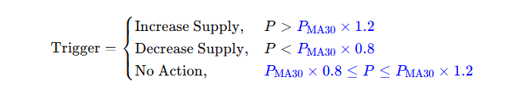

# Rebase System

### What is Rebasing?

\
Rebasing is the automatic adjustment of the COS token supply to influence its price. In Cosmos DAO, the rebasing mechanism keeps the COS token price within ±20% of its 30-day moving average. By increasing or decreasing the total supply of COS tokens, the system stabilizes the token’s value in response to market fluctuations.

### How the Rebasing System Works

\
The rebasing system operates on a daily cycle, comparing the COS token price to its 30-day moving average. Supply adjustments occur as follows:

<figure><figcaption></figcaption></figure>

* **If the COS price is >20% above the 30-day moving average:**&#x20;
  * The system increases the total supply of COS tokens to bring the price down toward the target range.
* **If the COS price is <20% below the 30-day moving average:**&#x20;
  * The system decreases the total supply of COS tokens to push the price up toward the target range.
* **If the COS price is within ±20% of the 30-day moving average:**&#x20;
  * No adjustment is made to the supply.

These adjustments ensure the COS token’s price remains stable over time, creating a reliable store of value within the Cosmos DAO ecosystem.

### How Rebase Works

* **Staking and xCOS:** When users stake their COS tokens, they are converted into xCOS (staked COS). The xCOS balance increases periodically through the protocol’s interest reward mechanism.
* **Epoch:** Rebase occurs at fixed intervals (e.g., every 8 hours). During each epoch, the protocol issues new COS tokens based on the total supply (COS\_totalSupply) and the reward rate (rewardRate).
* **Compounding Effect:** Newly issued COS tokens are primarily distributed to xCOS holders, increasing their xCOS balance automatically for a compounding effect. Interest accrues at 0.3957% per rebase.
* **Price Stability:** The COS token is backed by a minimum value of 1 DAI (or other assets). If the market price falls below this threshold, the protocol buys back and burns tokens to defend the price.
