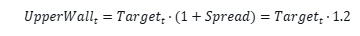

# 🔄Rebase Mechanism

| Item           | Description                             |
| -------------- | --------------------------------------- |
| **Cycle**      | Every 8 hours (UTC 00:00, 08:00, 16:00) |
| **Price Data** | Based on Chainlink Oracle               |
| **Logic**      | Adjust supply to keep price within ±20% |

​

## **Trigger Conditions**

<figure><figcaption></figcaption></figure>

* **If the COS price is >20% above the 30-day moving average:**&#x20;
  * The system increases the total supply of COS tokens to bring the price down toward the target range.
* **If the COS price is <20% below the 30-day moving average:**&#x20;
  * The system decreases the total supply of COS tokens to push the price up toward the target range.
* **If the COS price is within ±20% of the 30-day moving average:**&#x20;
  * No adjustment is made to the supply.

**Supply Adjustment Formula**

<figure><figcaption></figcaption></figure>

**Example**

<figure><figcaption></figcaption></figure>

**1.Supply Increase:**

<figure><figcaption></figcaption></figure>

**2.Supply Decrease:**

<figure><figcaption></figcaption></figure>

## **Staking (xCOS)**

When staking COS, it is converted into xCOS, which compounds automatically with every rebase. This means long-term holders benefit from **compound interest growth** as rewards accumulate continuously.

<figure><figcaption></figcaption></figure>

| Variable      | Description              |
| ------------- | ------------------------ |
| xCOS\_new     | Final xCOS balance       |
| xCOS\_current | Current xCOS balance     |
| r             | Interest rate per rebase |
| n             | Number of rebases        |

**Example**

1. New COS Amount

<figure><figcaption></figcaption></figure>

2. Annual APY

<figure><figcaption></figcaption></figure>

This is not a simple high-risk/high-return scheme—it reflects **continuous compounded growth** over time.

#### ⚖️ Interest Rate Determination

The staking interest rate is not fixed. It is determined by DAO governance based on **Treasury profitability** and the need for **ecosystem stability**.

<figure><figcaption></figcaption></figure>

| Variable       | Description        |
| -------------- | ------------------ |
| Y\_treasury    | Treasury yield     |
| S\_circulating | Circulating supply |
| r\_max         | Maximum rate       |

#### Staking Reward Distribution

<figure><figcaption></figcaption></figure>

| Variable  | Description                |
| --------- | -------------------------- |
| R\_i      | Reward for staker _i_      |
| xCOS\_i   | xCOS balance of staker _i_ |
| \sum xCOS | Total staked xCOS          |
| R\_total  | Total rewards pool         |

**Example**

<figure><figcaption></figcaption></figure>

Thus, larger stakes earn larger rewards, but **all stakers receive a fair proportional share**.

### 🛡 Price Defense

If the market price falls below the intrinsic backing value, a **Buyback and Burn** mechanism is triggered to defend the token price.

<figure><figcaption></figcaption></figure>

**Example**

<figure><figcaption></figcaption></figure>

### Buyback Funding

Buybacks are not unlimited—they are constrained by Treasury resources and DAO-defined rules.

<figure><figcaption></figcaption></figure>

**Example**

<figure><figcaption></figcaption></figure>
